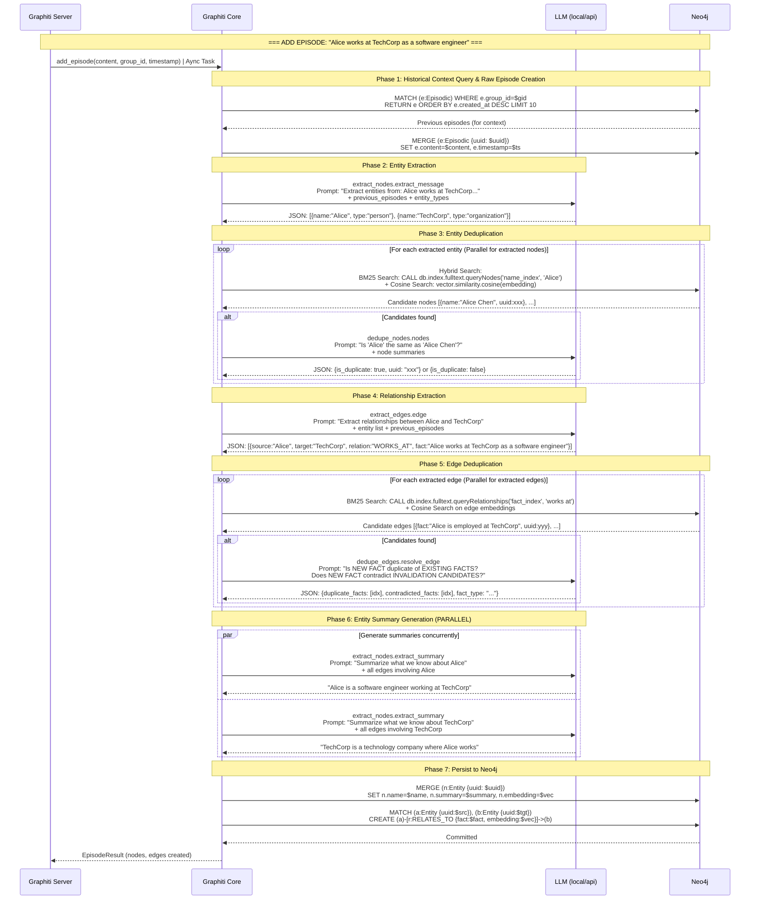
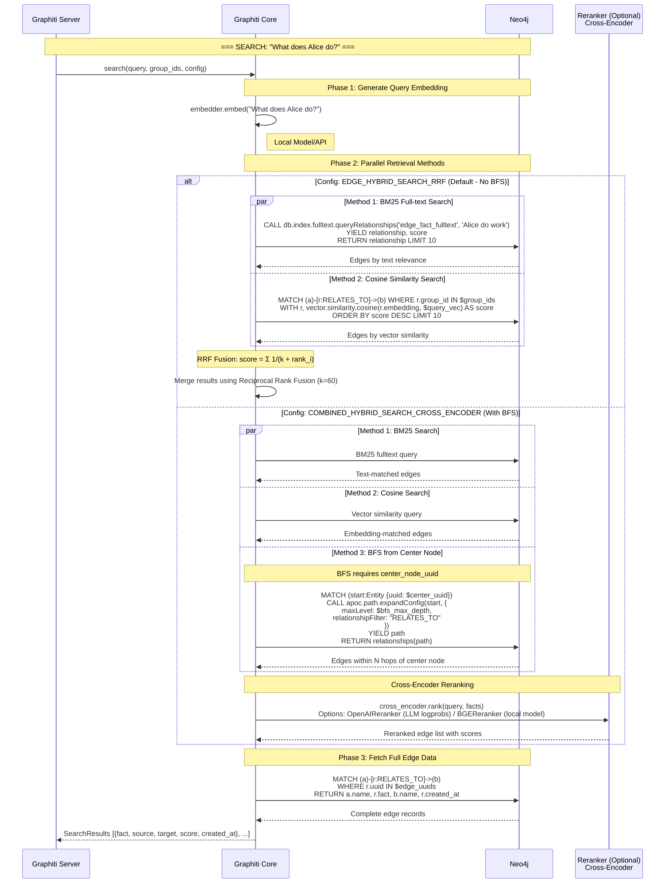

# Data Flow Diagrams for Graphiti + Neo4j

## Add Episode Flow

This diagram shows the complete flow of `graphiti.add_episode()` operation, including all LLM calls, Neo4j queries, and data transformations.

**Typical Duration:** ~6 seconds (LLM accounts for 89% of time)

### Sequence Diagram

### Time Breakdown (from trace logs)

| Phase | Duration | Component |
|-------|----------|-----------|
| Entity Extraction | ~1.7s | LLM |
| Entity Deduplication | ~1.3s | LLM |
| Edge Extraction | ~2.2s | LLM (slowest) |
| Summary Generation | ~0.6s | LLM (parallel) |
| Neo4j Queries | ~0.7s | DB |
| **Total** | **~6.5s** | **LLM: 89%** |

## Search Flow

This diagram shows the complete flow of `graphiti.search()` operation, including different search configurations and optional BFS traversal.

**Typical Duration:** ~130ms (no LLM reranking) or ~1-2s (with LLM reranking)

### Sequence Diagram

### Search Configuration Comparison

| Search Config | BM25 | Cosine | BFS | LLM Rerank | Use Case |
|---------------|------|--------|-----|------------|----------|
| `EDGE_HYBRID_SEARCH_RRF` | ✅ | ✅ | ❌ | ❌ (RRF) | Fast retrieval, no LLM needed |
| `EDGE_HYBRID_SEARCH_NODE_DISTANCE` | ✅ | ✅ | ✅ | ❌ (RRF) | Explore from known node |
| `EDGE_HYBRID_SEARCH_CROSS_ENCODER` | ✅ | ✅ | ❌ | ✅ | High precision, needs LLM |
| `COMBINED_HYBRID_SEARCH_CROSS_ENCODER` | ✅ | ✅ | ✅ | ✅ | Most comprehensive, slowest |

### Time Breakdown

**Without LLM Reranking (~130ms):**

| Phase | Duration | Component |
|-------|----------|-----------|
| Embedding Generation | ~3ms | Local model |
| BM25 + Cosine Search | ~127ms | Neo4j |
| **Total** | **~130ms** | **100% DB** |

**With LLM Reranking (~1-2s):**

| Phase | Duration | Component |
|-------|----------|-----------|
| Embedding Generation | ~3ms | Local model |
| BM25 + Cosine + BFS | ~150ms | Neo4j |
| LLM Reranking | ~1-2s | LLM |
| **Total** | **~1.5s** | **LLM: 90%** |

