# Data Flow Diagrams for Graphiti + Neo4j

## 1. Insertion: Add Episode Flow

This section covers the complete flow of `graphiti.add_episode()` operation.

### 1.1 Overview: LLM Queries for Each Turn

This table shows all LLM calls made for each conversational turn (episode).

#### Turn 1: Introduction Message
**Input Message:** `"Alice Chen(user): Hi, I'm Alice Chen. I work at TechCorp as a senior software engineer."`

| Call # | Type | Purpose | Output Summary |
|--------|------|---------|----------------|
| 1 | Entity Extraction | Extract entities from text | `[{name: "Alice Chen"}, {name: "TechCorp"}]` |
| 2 | Entity Deduplication | Check if entities exist | `{duplicate_idx: -1}` (both are new) |
| 3 | Edge Extraction | Extract relationships | `[{source: "Alice Chen", target: "TechCorp", relation: "WORKS_AT", fact: "Alice Chen works at TechCorp as a senior software engineer."}]` |
| 4 | Edge Deduplication | Check for duplicate facts | `{duplicate_facts: [], contradicted_facts: []}` (new fact) |
| 5 | Entity Summary Generation (×2, parallel) | Generate entity summaries | Alice: "Alice Chen works at TechCorp..."<br>TechCorp: "TechCorp employs Alice Chen..." |

**Graph State After Turn 1:**
```
┌──────────────────────────────┐
│ Episodic: ef48db72           │
│   content: "Alice Chen..."   │
│   entity_edges: [fc5b1af8]   │
└───────┬──────────────┬───────┘
        │ MENTIONS     │ MENTIONS
        ▼              ▼
┌───────────────┐    ┌───────────────┐
│ Entity:       │    │ Entity:       │
│ Alice Chen    │    │ TechCorp      │
│ 198d581d      │    │ a1b2c3d4      │
└───────┬───────┘    └───────▲───────┘
        │                    │
        └────RELATES_TO──────┘
              WORKS_AT
              fc5b1af8

Nodes: [Episodic:ef48db72, Entity:198d581d (Alice), Entity:a1b2c3d4 (TechCorp)]
Edges: [MENTIONS×2, RELATES_TO×1]
```

#### Turn 2: Project Information
**Input Message:** `"Alice Chen(user): I'm currently leading Project Phoenix, a major cloud migration initiative."`

| Call # | Type | Purpose | Output Summary |
|--------|------|---------|----------------|
| 6 | Entity Extraction | Extract entities | `[{name: "Alice Chen"}, {name: "Project Phoenix"}]` |
| 7 | Entity Deduplication | Check duplicates | `Alice Chen → duplicate_idx: 0` (reuse existing)<br>`Project Phoenix → duplicate_idx: -1` (new) |
| 8 | Edge Extraction | Extract relationships | `[{source: "Alice Chen", target: "Project Phoenix", relation: "LEADING_PROJECT"}]` |
| 9 | Edge Deduplication | Check facts | `{duplicate_facts: [], contradicted_facts: []}` |
| 10 | Entity Summary Generation (×2) | Update summaries | Alice: Updated with "leading Project Phoenix"<br>Project Phoenix: New summary |

**Graph State After Turn 2:**

New entities: Project Phoenix (597ad016)
Reused entities: Alice Chen (198d581d) - summary updated
New edges: LEADING_PROJECT (291f347f)

```
┌──────────────────────────────┐  ┌──────────────────────────────┐
│ Episodic: ef48db72           │  │ Episodic: b31f0028           │
│ (Episode 1)                  │  │ (Episode 2)                  │
└───────┬──────────────┬───────┘  └───────┬──────────────────────┘
        │              │                  │
        │ MENTIONS     │ MENTIONS         │ MENTIONS
        ▼              ▼                  ▼
┌───────────────┐    ┌───────────────┐  ┌───────────────────────┐
│ Entity:       │    │ Entity:       │  │ Entity:               │
│ Alice Chen    │◄───│ TechCorp      │  │ Project Phoenix       │
│ 198d581d      │    │ a1b2c3d4      │  │ 597ad016              │
└───────┬───────┘    └───────────────┘  └───────────▲───────────┘
        │                                           │
        └────────RELATES_TO: LEADING_PROJECT────────┘
                     291f347f

Nodes: [Episodic×2, Entity×3]
Edges: [MENTIONS×4, RELATES_TO×2 (WORKS_AT, LEADING_PROJECT)]
```

#### Turn 3: Deadline Information
**Input Message:** `"Alice Chen(user): The project deadline is February 15th, and we have 3 team members."`

| Call # | Type | Purpose | Output Summary |
|--------|------|---------|----------------|
| 11 | Entity Extraction | Extract entities | `[{name: "Alice Chen"}, {name: "Project Phoenix"}]` |
| 12 | Entity Deduplication | Check duplicates | Both entities resolved to existing UUIDs |
| 13 | Edge Extraction | Extract relationships | `[{fact: "Alice Chen leads Project Phoenix..."}, {fact: "deadline is February 15th..."}]` |
| 14 | Edge Deduplication | Check facts | `{duplicate_facts: [0], contradicted_facts: [0]}` ("leads" duplicates existing) |
| 15 | Entity Summary Generation (×2) | Update summaries | Alice: Updated with "deadline February 15th, 3 team members" |

**Graph State After Turn 3 (Final):**

Reused entities: Alice Chen, Project Phoenix - summaries updated
New edges: PROJECT_DEADLINE (70e5c2b0)
Duplicate detected: "leads Project Phoenix" → appends episode UUID to existing edge

```
                      ┌──────────────────────────────┐
                      │ Episodic: b6cb0fbd           │
                      │ (Episode 3)                  │
                      └───────┬──────────────┬───────┘
                              │ MENTIONS     │ MENTIONS
                              ▼              ▼
┌───────────────┐    ┌───────────────┐    ┌───────────────────────┐
│ TechCorp      │◄───│ Alice Chen    │───►│ Project Phoenix       │
│ a1b2c3d4      │    │ 198d581d      │    │ 597ad016              │
└───────────────┘    └───────────────┘    └───────────────────────┘
       ▲                    │                      │
       │                    │                      │
  WORKS_AT            LEADING_PROJECT        PROJECT_DEADLINE
  fc5b1af8            291f347f               70e5c2b0
  episodes:[ep1]      episodes:[ep2,ep3]     episodes:[ep3]
                      (ep3 appended due
                       to duplicate)

Final Counts:
- Episodic Nodes: 3
- Entity Nodes: 3 (Alice Chen, TechCorp, Project Phoenix)
- MENTIONS Edges: 6 (each episode connects to 2 entities)
- RELATES_TO Edges: 3 (WORKS_AT, LEADING_PROJECT, PROJECT_DEADLINE)
```

**Key Observations from Logs:**
- **17 total LLM calls** across 3 episodes
- **Summary Generation is parallel**: Call 5 has 2 responses (Alice Chen + TechCorp summaries)
- **Entity deduplication reuses UUIDs**: "Alice Chen" in Turn 2/3 maps to the UUID from Turn 1
- **Edge deduplication detects duplicates**: Turn 3's "leads Project Phoenix" is flagged as duplicate of Turn 2's "leading Project Phoenix"

---

### 1.2 Sequence Diagram

This diagram shows the complete flow of `graphiti.add_episode()` operation, including all LLM calls, Neo4j queries, and data transformations.

**Typical Duration:** ~6 seconds (LLM accounts for 89% of time)

```mermaid
sequenceDiagram
    participant App as Graphiti Server
    participant Core as Graphiti Core
    participant LLM as LLM (local/api)
    participant Neo4j as Neo4j

    Note over App, Neo4j: === ADD EPISODE: "Alice works at TechCorp as a software engineer" ===

    App->>Core: add_episode(content, group_id, timestamp) | Async Task

    Note over Core, Neo4j: Phase 1: Historical Context Query & Episode Creation (in-memory) | 👍 relational topk
    Core->>Neo4j: MATCH (e:Episodic) WHERE e.group_id=$gid<br/>RETURN e ORDER BY e.created_at DESC LIMIT 10
    Neo4j-->>Core: Previous episodes (for context)
    Note right of Core: Create EpisodicNode object in memory<br/>(NOT written to DB yet)

    Note over Core, LLM: Phase 2: Entity Extraction | 👍 sem_map
    Core->>LLM: extract_nodes.extract_message<br/>Prompt: "Extract entities from: Alice works at TechCorp..."<br/>+ previous_episodes + entity_types
    LLM-->>Core: JSON: [{name:"Alice", type:"person"}, {name:"TechCorp", type:"organization"}]

    Note over Core, Neo4j: Phase 3: Entity Deduplication | 👍 relational topk (sem_topk), sem_filter
    par Parallel search for each extracted entity
        Core->>Neo4j: Hybrid Search (entity 1: "Alice"):<br/>BM25: queryNodes('name_index', 'Alice')<br/>+ Cosine: vector.similarity.cosine(name_embedding)
        Neo4j-->>Core: Candidate nodes for "Alice"
    and
        Core->>Neo4j: Hybrid Search (entity 2: "TechCorp"):<br/>BM25 + Cosine
        Neo4j-->>Core: Candidate nodes for "TechCorp"
    end

    alt Any unresolved entities with candidates
        Core->>LLM: dedupe_nodes.nodes (SINGLE LLM CALL for ALL entities)<br/>Prompt: "Are these extracted entities duplicates of existing ones?"<br/>+ all extracted entities + all candidate lists
        LLM-->>Core: JSON: {entity_resolutions: [{id:0, duplicate_idx:-1}, {id:1, duplicate_idx:-1}]}
        Note right of Core: duplicate_idx=-1 means new entity<br/>duplicate_idx>=0 points to existing entity index
    end

    Note over Core, LLM: Phase 4: Relationship Extraction | 👍 sem_map
    Core->>LLM: extract_edges.edge<br/>Prompt: "Extract relationships between Alice and TechCorp"<br/>+ entity list + previous_episodes
    LLM-->>Core: JSON: [{source:"Alice", target:"TechCorp", relation:"WORKS_AT", fact:"Alice works at TechCorp as a software engineer"}]

    Note over Core, Neo4j: Phase 5: Edge Deduplication | 👍 relational topk, sem_filter
    Note right of Core: First: generate embeddings for all extracted edges<br/>(required BEFORE search)
    par Parallel search for each extracted edge
        Core->>Neo4j: Hybrid Search (edge 1: "WORKS_AT"):<br/>BM25: queryRelationships('fact_index', 'works at')<br/>+ Cosine: vector.similarity.cosine(fact_embedding)
        Neo4j-->>Core: Candidate edges for edge 1
    end

    Note right of Core: LLM dedup calls are parallel (one per edge with candidates)
    alt Candidates found for edge 1
        Core->>LLM: dedupe_edges.resolve_edge (PER-EDGE LLM CALL)<br/>Prompt: "Is NEW FACT duplicate/contradiction of EXISTING FACTS?"
        LLM-->>Core: JSON: {duplicate_facts: [], contradicted_facts: [], fact_type: "..."}
    end

    Note over Core, LLM: Phase 6: Entity Summary Generation (PARALLEL) | 👍 sem_agg
    par Generate summaries concurrently
        Core->>LLM: extract_nodes.extract_summary<br/>Prompt: "Summarize what we know about Alice"<br/>+ all edges involving Alice
        LLM-->>Core: "Alice is a software engineer working at TechCorp"
    and
        Core->>LLM: extract_nodes.extract_summary ... "TechCorp"
        LLM-->>Core: "TechCorp is ..."
    end

    Note over Core, Neo4j: Phase 7: Persist to Neo4j (Bulk Save in Order)
    rect rgb(240, 248, 255)
        Note right of Core: 7a. Save Episode Node
        Core->>Neo4j: MERGE (n:Episodic {uuid: $uuid})<br/>SET n = {content, entity_edges, ...}
        Note right of Core: 7b. Save Entity Nodes
        Core->>Neo4j: MERGE (n:Entity {uuid: $uuid})<br/>SET n = {name, summary, ...}<br/>+ setNodeVectorProperty(name_embedding)
        Note right of Core: 7c. Save EpisodicEdges (MENTIONS)
        Core->>Neo4j: MATCH (episode:Episodic), (entity:Entity)<br/>MERGE (episode)-[:MENTIONS]->(entity)
        Note right of Core: 7d. Save EntityEdges (RELATES_TO)
        Core->>Neo4j: MATCH (src:Entity), (tgt:Entity)<br/>MERGE (src)-[e:RELATES_TO]->(tgt)<br/>SET e = {fact, episodes, ...}<br/>+ setRelationshipVectorProperty(fact_embedding)
    end
    Neo4j-->>Core: Committed

    Note over Core, Neo4j: Phase 8: Community Update (OPTIONAL, PARALLEL) | update_communities=False by default | 👍 sem_agg
    Note right of Core: Runs AFTER Phase 7 bulk save completes<br/>Writes IMMEDIATELY (not bulk save)
    opt update_communities=True
        par For each entity node (parallel via semaphore_gather)
            Core->>Neo4j: determine_entity_community<br/>1. Check if entity already has community<br/>2. Find neighboring entities' communities
            Neo4j-->>Core: (community, is_new) tuple

            alt community found
                Core->>LLM: summarize_pair(entity.summary, community.summary)
                LLM-->>Core: Merged summary
                Core->>LLM: generate_summary_description(merged_summary)
                LLM-->>Core: New community name

                alt is_new = True (entity not yet in community)
                    Core->>Neo4j: community_edge.save()<br/>CREATE (Community)-[:HAS_MEMBER]->(Entity)
                end
                Core->>Neo4j: community.save()<br/>MERGE (c:Community {uuid})<br/>SET c.summary, c.name, c.name_embedding
            end
        end
    end

    Core-->>App: EpisodeResult (nodes, edges, communities)
```



### 1.3 Time Breakdown (from trace logs)

| Phase | Duration | Component |
|-------|----------|-----------|
| Entity Extraction | ~1.7s | LLM |
| Entity Deduplication | ~1.3s | LLM |
| Edge Extraction | ~2.2s | LLM (slowest) |
| Summary Generation | ~0.6s | LLM (parallel) |
| Neo4j Queries | ~0.7s | DB |
| **Total** | **~6.5s** | **LLM: 89%** |

---

### 1.4 Step-by-Step Analysis

**Input Message Example:**

```
"Hi, I'm Alice Chen. I work at TechCorp as a senior software engineer."
```

#### Step 1: Query Previous Episodes & Create Episode (in-memory)

> **⚠️ Important:** Episode is NOT written to DB at this step. Only queried and created in memory.

**Database Query (retrieve previous episodes for context):**
```cypher
MATCH (e:Episodic) WHERE e.group_id = $gid
RETURN e ORDER BY e.created_at DESC LIMIT 10
```

**Input:**
```python
{
    "content": "Alice Chen(user): Hi, I'm Alice Chen. I work at TechCorp as a senior software engineer.",
    "group_id": "demo_session_20260203_204107",
    "source": "message",
    "source_description": "Agent conversation message"
}
```

**Output (EpisodicNode - IN MEMORY, not yet in DB):**
```python
{
    "uuid": "ef48db72-c855-4e04-b5d2-654f01a240c6",
    "name": "Alice Chen",
    "content": "Alice Chen(user): Hi, I'm Alice Chen...",
    "group_id": "demo_session_20260203_204107",
    "source": "message",
    "valid_at": "2026-02-03T12:41:07.285892Z",
    "entity_edges": []  # Updated after edge extraction
}
```

**Graph State After Step 1:**
```
Graph: (empty or existing state from previous episodes)
New in-memory object: EpisodicNode(uuid="ef48db72-...")
DB writes: NONE
```

---

#### Step 2: Entity Extraction (LLM Call #1)

**LLM Prompt Type:** `extract_nodes.extract_message`

**Input to LLM:**
```
You are an AI assistant that extracts entity nodes from conversational messages.
Your primary task is to identify and extract entities mentioned in the text.

Message: "Hi, I'm Alice Chen. I work at TechCorp as a senior software engineer."
Previous Episodes: [...context...]
Entity Types: [default types]
```

**LLM Output:**
```json
{
  "extracted_entities": [
    {"name": "Alice Chen", "entity_type_id": 0},
    {"name": "TechCorp", "entity_type_id": 0}
  ]
}
```

**Data Transformation:**
- Raw text → Structured entity list with names and types
- Each entity gets a temporary ID (0, 1, ...) for reference in edge extraction

---

#### Step 3: Entity Deduplication (LLM Call #2)

**Purpose:** Check if extracted entities already exist in the database

**Database Query (Hybrid Search for each entity):**
```cypher
-- BM25 Search
CALL db.index.fulltext.queryNodes("node_name_and_summary", $query, {limit: $limit})
YIELD node AS n, score WHERE n.group_id IN $group_ids
RETURN n.uuid, n.name, n.summary

-- Cosine Similarity Search
MATCH (n:Entity) WHERE n.group_id IN $group_ids
WITH n, vector.similarity.cosine(n.name_embedding, $search_vector) AS score
WHERE score > $min_score
RETURN n.uuid, n.name, n.summary
```

**LLM Prompt Type:** `dedupe_nodes.nodes`

**Input to LLM:**
```
You are a helpful assistant that determines whether or not ENTITIES
extracted from a conversation are duplicates of existing entities.

Extracted Entity: "Alice Chen"
Candidate Matches: [{name: "Alice Chen", summary: "..."}]
```

**LLM Output (First Episode - No Duplicates):**
```json
{
  "entity_resolutions": [
    {"id": 0, "duplicate_idx": -1, "name": "Alice Chen", "duplicates": []},
    {"id": 1, "duplicate_idx": -1, "name": "TechCorp", "duplicates": []}
  ]
}
```

**LLM Output (in subsequent episodes - Duplicate Found):**
```json
{
  "entity_resolutions": [
    {"id": 0, "duplicate_idx": -1, "name": "Project Phoenix", "duplicates": []}
    // "Alice Chen" is a duplicate, so it is not in output.
  ]
}
```

> **⚠️ Embedding Timing Note:**
> Entity deduplication does **NOT** require embedding for the new entity.
> - **BM25** uses entity name as keyword (e.g., "Alice Chen")
> - **Cosine search** uses existing entities' `name_embedding` stored in DB
> - New entity's embedding is generated only at **persist time (Step 8)** via `node.generate_name_embedding(embedder)`

---

#### Step 4: Edge/Relationship Extraction (LLM Call #3)

**LLM Prompt Type:** `extract_edges.edge`

**Input to LLM:**
```
You are an expert fact extractor that extracts fact triples from text.
1. Extracted fact triples should be atomic
2. Each fact should have source_entity_id, target_entity_id, relation_type, fact

Entities: ["Alice Chen", "TechCorp"]
Message: "Hi, I'm Alice Chen. I work at TechCorp as a senior software engineer."
```

**LLM Output:**
```json
{
  "edges": [
    {
      "relation_type": "WORKS_AT",
      "source_entity_id": 0,
      "target_entity_id": 1,
      "fact": "Alice Chen works at TechCorp as a senior software engineer.",
      "valid_at": "2026-02-03T12:41:07.285892Z",
      "invalid_at": null
    }
  ]
}
```

**Data Transformation:**
- Entity IDs (0, 1) → Resolved to actual UUIDs
- Creates `EntityEdge` objects with:
  - `source_node_uuid`: UUID of "Alice Chen"
  - `target_node_uuid`: UUID of "TechCorp"
  - `name`: "WORKS_AT"
  - `fact`: Full fact sentence
  - `episodes`: [episode_uuid]

---

#### Step 5: Edge Deduplication (LLM Call - if candidates found)

> **⚠️ Embedding Timing Note:**
> Edge deduplication **REQUIRES** embedding **BEFORE** search.
> - `create_entity_edge_embeddings(embedder, extracted_edges)` is called first
> - Then hybrid search uses this embedding for cosine similarity
> - See `graphiti_core/utils/maintenance/edge_operations.py:319`

**Database Query (Hybrid Search for edges):**
```cypher
-- BM25 Search for existing edges
CALL db.index.fulltext.queryRelationships("edge_name_and_fact", $query, {limit: $limit})
YIELD relationship AS rel, score
MATCH (n:Entity)-[e:RELATES_TO {uuid: rel.uuid}]->(m:Entity)
WHERE e.group_id IN $group_ids
RETURN e.uuid, e.fact, e.name

-- Cosine Similarity Search for edges
MATCH (n:Entity)-[e:RELATES_TO]->(m:Entity)
WHERE e.group_id IN $group_ids
WITH e, vector.similarity.cosine(e.fact_embedding, $search_vector) AS score
WHERE score > $min_score
RETURN e.uuid, e.fact, e.name
```

**LLM Prompt Type:** `dedupe_edges.resolve_edge`

**LLM Input (Complete Prompt):**
```
System: You are a helpful assistant that de-duplicates facts from fact lists
and determines which existing facts are contradicted by the new fact.

User:
Task:
You will receive TWO separate lists of facts. Each list uses 'idx' as its index field, starting from 0.

1. DUPLICATE DETECTION:
   - If the NEW FACT represents identical factual information as any fact in EXISTING FACTS,
     return those idx values in duplicate_facts.
   - Facts with similar information that contain key differences should NOT be marked as duplicates.
   - Return idx values from EXISTING FACTS.
   - If no duplicates, return an empty list for duplicate_facts.

2. FACT TYPE CLASSIFICATION:
   - Given the predefined FACT TYPES, determine if the NEW FACT should be classified as one of these types.
   - Return the fact type as fact_type or DEFAULT if NEW FACT is not one of the FACT TYPES.

3. CONTRADICTION DETECTION:
   - Based on FACT INVALIDATION CANDIDATES and NEW FACT, determine which facts the new fact contradicts.
   - Return idx values from FACT INVALIDATION CANDIDATES.
   - If no contradictions, return an empty list for contradicted_facts.

<FACT TYPES>
[]
</FACT TYPES>

<EXISTING FACTS>
[{idx: 0, fact: "Alice Chen is currently leading Project Phoenix."}]
</EXISTING FACTS>

<FACT INVALIDATION CANDIDATES>
[{idx: 0, fact: "Alice Chen is currently leading Project Phoenix."}]
</FACT INVALIDATION CANDIDATES>

<NEW FACT>
"Alice Chen leads Project Phoenix, a cloud migration initiative."
</NEW FACT>
```

**LLM Output (No Duplicate):**
```json
{
  "duplicate_facts": [],
  "contradicted_facts": [],
  "fact_type": "DEFAULT"
}
```

**LLM Output (Duplicate Found - Episode 3):**
```json
{
  "duplicate_facts": [0],
  "contradicted_facts": [0],
  "fact_type": "DEFAULT"
  // "Alice Chen leads Project Phoenix" duplicates "Alice Chen is currently leading Project Phoenix"
}
```

---

#### Step 6: Summary Generation (LLM Calls #4, #5 - Parallel)

**LLM Prompt Type:** `extract_nodes.extract_summary`

**Input to LLM:**
```
You are a helpful assistant that extracts entity summaries from the provided text.
Do not escape unicode characters.

Entity: "Alice Chen"
Related Facts: ["Alice Chen works at TechCorp as a senior software engineer."]
```

**LLM Output (Call 5 has 2 responses - executed in parallel via `semaphore_gather`):**
```json
// Response 1 (Alice Chen)
{"summary": "Alice Chen works at TechCorp as a senior software engineer."}

// Response 2 (TechCorp)
{"summary": "TechCorp employs Alice Chen as a senior software engineer."}
```

**Summary Evolution Over Episodes:**

| Episode | Entity | Summary |
|---------|--------|---------|
| 1 | Alice Chen | "Alice Chen works at TechCorp as a senior software engineer." |
| 2 | Alice Chen | "Alice Chen works at TechCorp as a senior software engineer, leading Project Phoenix, a cloud migration initiative." |
| 3 | Alice Chen | "Alice Chen works at TechCorp as a senior software engineer, leading Project Phoenix, a cloud migration initiative with a deadline of February 15th and 3 team members." |

**Note:** The summary is stored in `EntityNode.summary` field and **updated via MERGE + SET** when the same entity is encountered in subsequent episodes.

---

#### Step 7: Build EpisodicEdges (Episode → Entity Connection)

**Function:** `build_episodic_edges(entity_nodes, episode_uuid, created_at)`

**Purpose:** Creates `(Episode)-[:MENTIONS]->(Entity)` relationships

**Cypher Query (EPISODIC_EDGE_SAVE):**
```cypher
MATCH (episode:Episodic {uuid: $episode_uuid})
MATCH (node:Entity {uuid: $entity_uuid})
MERGE (episode)-[e:MENTIONS {uuid: $uuid}]->(node)
SET
    e.group_id = $group_id,
    e.created_at = $created_at
RETURN e.uuid AS uuid
```

**Episode.entity_edges Update:**
```python
episode.entity_edges = [edge.uuid for edge in entity_edges]  # List of EntityEdge UUIDs
```

**Note:** `episode.entity_edges` stores **EntityEdge** UUIDs (RELATES_TO relationships), NOT EpisodicEdge UUIDs.

---

#### Step 8: Persist to Neo4j (Bulk Save)

> **⚠️ Important Notes:**
> 1. **All modifications are IN-MEMORY operations** until this step. This includes:
>    - Duplicate handling (`existing_edge.episodes.append(current_episode.uuid)`)
>    - Invalidation (`old_edge.invalid_at = new_edge.valid_at; old_edge.expired_at = utc_now()`)
>    - Summary updates (`entity.summary = new_summary`)
> 2. **Embedding generation check:** If `name_embedding` or `fact_embedding` is `None`, it's generated here via `node.generate_name_embedding(embedder)` or `edge.generate_embedding(embedder)`
> 3. **MERGE + SET pattern** overwrites all fields, ensuring all in-memory changes are persisted

**Write Order (from `bulk_utils.py:239-250`):**

| Step | Operation | Cypher |
|------|-----------|--------|
| **8a** | Save Episode Node | `MERGE (n:Episodic {uuid}) SET n = {..., entity_edges: [...]}` |
| **8b** | Save Entity Nodes | `MERGE (n:Entity {uuid}) SET n = {...}` + `setNodeVectorProperty(name_embedding)` |
| **8c** | Save EpisodicEdges | `MATCH (episode:Episodic), (entity:Entity) MERGE (episode)-[:MENTIONS]->(entity)` |
| **8d** | Save EntityEdges | `MATCH (src:Entity), (tgt:Entity) MERGE (src)-[e:RELATES_TO]->(tgt) SET e = {...}` + `setRelationshipVectorProperty(fact_embedding)` |

**8a. Episode Node Save Query:**
```cypher
MERGE (n:Episodic {uuid: "ef48db72-..."})
SET n = {content: "...", entity_edges: ["fc5b1af8-..."], ...}
```

**8b. Entity Node Save Query:**
```cypher
MERGE (n:Entity {uuid: $entity_data.uuid})
SET n:Entity
SET n = $entity_data
WITH n CALL db.create.setNodeVectorProperty(n, "name_embedding", $entity_data.name_embedding)
RETURN n.uuid AS uuid
```

**8c. EpisodicEdge Save Query (MENTIONS):**
```cypher
MATCH (episode:Episodic {uuid: "ef48db72-..."})
MATCH (node:Entity {uuid: "198d581d-..."})  -- Alice Chen
MERGE (episode)-[e:MENTIONS]->(node)
```

**8d. EntityEdge Save Query (RELATES_TO):**
```cypher
MATCH (source:Entity {uuid: $edge_data.source_uuid})
MATCH (target:Entity {uuid: $edge_data.target_uuid})
MERGE (source)-[e:RELATES_TO {uuid: $edge_data.uuid}]->(target)
SET e = $edge_data
WITH e CALL db.create.setRelationshipVectorProperty(e, "fact_embedding", $edge_data.fact_embedding)
RETURN e.uuid AS uuid
```

**Graph State After Step 8:** See "Graph State After Turn 1" in Section 1.1.

### 1.5 Data Model and Handling Logic

This section combines data structure definitions with their handling logic (duplicate, update, invalidation).

#### EpisodicNode (No Embedding)
```python
{
    "uuid": "ef48db72-...",
    "name": "Alice Chen",
    "content": "Alice Chen(user): Hi, I'm Alice Chen...",  # Raw text
    "source": "message",
    "valid_at": "2026-02-03T12:41:07Z",
    "entity_edges": ["fc5b1af8-..."],  # List of EntityEdge UUIDs referenced
    # NO embedding field!
}
```

**Handling:** Episodes are always created as new nodes. No deduplication.

---

#### EntityNode (Has Embedding)
```python
{
    "uuid": "198d581d-...",
    "name": "Alice Chen",
    "summary": "Alice Chen works at TechCorp...",  # Updated across episodes
    "name_embedding": [-0.0263, 0.0132, ...],  # 384-dim vector
    # NO episodes field! Connection via EpisodicEdge
}
```

**Entity Deduplication Handling:**

| Scenario | Action | Code Location |
|----------|--------|---------------|
| **New Entity** | Create new EntityNode with new UUID | `uuid_map[new_uuid] = new_uuid` |
| **Duplicate Found** | Reuse existing UUID, update summary | `uuid_map[new_uuid] = existing_uuid` |
| **Summary Update** | MERGE uses same UUID, SET updates fields | `MERGE (n:Entity {uuid: ...}) SET n = $data` |

**Note:** Entity nodes are **never invalidated**. Only their `summary` field is updated.

---

#### EntityEdge (Has Embedding + Episodes List)
```python
{
    "uuid": "fc5b1af8-...",
    "name": "WORKS_AT",
    "fact": "Alice Chen works at TechCorp as a senior software engineer.",
    "fact_embedding": [0.0123, -0.0456, ...],  # 384-dim vector
    "source_node_uuid": "198d581d-...",  # Alice Chen
    "target_node_uuid": "a1b2c3d4-...",  # TechCorp
    "episodes": ["ef48db72-..."],  # List of episode UUIDs that reference this fact
    "valid_at": "2026-02-03T12:41:07Z",
    "invalid_at": null,  # Set when contradicted
    "expired_at": null   # Set when invalid_at is set
}
```

**Edge Deduplication Handling:**

| Scenario | LLM Response | Action |
|----------|--------------|--------|
| **New Fact** | `{duplicate_facts: [], contradicted_facts: []}` | Create new EntityEdge |
| **Duplicate Fact** | `{duplicate_facts: [0]}` | Append current episode UUID to existing edge's `episodes` list |
| **Contradicted Fact** | `{contradicted_facts: [0]}` | Set `invalid_at` and `expired_at` on old edge |

**Example from Episode 3:**
```python
# LLM detected "leads Project Phoenix" is duplicate of "leading Project Phoenix"
response = {"duplicate_facts": [0], "contradicted_facts": [0]}

# Action: Append episode UUID to existing edge
existing_edge.episodes.append(current_episode.uuid)
# Edge 291f347f.episodes: ["b31f0028"] → ["b31f0028", "b6cb0fbd"]
```

**Edge Invalidation (Contradiction Handling):**

When a new fact contradicts an existing fact:
```python
# Old edge gets expired
old_edge.invalid_at = new_edge.valid_at
old_edge.expired_at = utc_now()

# New edge is still created
new_edge.valid_at = message_timestamp
```

---

#### EpisodicEdge (MENTIONS Relationship)
```python
{
    "uuid": "auto-generated",
    "source_node_uuid": "ef48db72-...",  # Episode UUID
    "target_node_uuid": "198d581d-...",  # Entity UUID
    "created_at": "2026-02-03T12:41:08Z",
    "group_id": "demo_session_..."
    # Creates (Episodic)-[:MENTIONS]->(Entity) in Neo4j
}
```

**Handling:** Created automatically via `build_episodic_edges()` for each entity mentioned in an episode.


---

## 2. Search Flow

This section covers the complete flow of `graphiti.search()` operation, including different search configurations and optional BFS traversal.

**Typical Duration:** ~130ms (no LLM reranking) or ~1-2s (with LLM reranking)

### 2.1 Sequence Diagram

```mermaid
sequenceDiagram
    participant App as Graphiti Server
    participant Core as Graphiti Core
    participant Neo4j as Neo4j
    participant Reranker as Reranker (Optional)<br/>Cross-Encoder

    Note over App, Neo4j: === SEARCH: "What does Alice do?" ===

    App->>Core: search(query, group_ids, config)

    Note over Core, Neo4j: Phase 1: Generate Query Embedding
    Core->>Core: embedder.embed("What does Alice do?")
    Note right of Core: Local Model/API

    Note over Core, Neo4j: Phase 2: Parallel Retrieval Methods | 👍 relational topk (sem_topk)
    Note right of Core: Edge, Node, Episode, Community searches run in parallel via semaphore_gather

    alt Config: EDGE_HYBRID_SEARCH_RRF (Default - No BFS)
        par BM25 + Cosine (parallel)
            Core->>Neo4j: BM25: queryRelationships('edge_fact_fulltext', $query)
            Neo4j-->>Core: Edges by text relevance
        and
            Core->>Neo4j: Cosine: vector.similarity.cosine(fact_embedding, $query_vec)
            Neo4j-->>Core: Edges by vector similarity
        and Community Search (if community_config enabled)
            Core->>Neo4j: BM25 + Cosine on Community nodes (NO BFS)
            Neo4j-->>Core: Communities by relevance
        end

        Note over Core: RRF Fusion: score = Σ 1/(k + rank_i)
        Core->>Core: Merge results using Reciprocal Rank Fusion (k=60)

    else Config: EDGE_HYBRID_SEARCH_CROSS_ENCODER (With BFS + vLLM Reranking)
        par Step 1: BM25 + Cosine (parallel)
            Core->>Neo4j: BM25 Search on edges
            Neo4j-->>Core: Text-matched edges
        and
            Core->>Neo4j: Cosine Search on edges
            Neo4j-->>Core: Embedding-matched edges
        and Community Search (if community_config enabled)
            Core->>Neo4j: BM25 + Cosine on Community nodes (NO BFS)
            Neo4j-->>Core: Communities by relevance
        end

        Note right of Core: Step 2: BFS requires BM25+Cosine results first<br/>(origin nodes extracted from initial results)
        Core->>Neo4j: BFS Graph Traversal<br/>UNWIND $bfs_origin_node_uuids AS origin_uuid<br/>MATCH path = (origin)-[:RELATES_TO|MENTIONS*1..3]->(:Entity)
        Neo4j-->>Core: Edges within 1-3 hops of origin nodes

        Note over Core, Reranker: Cross-Encoder Reranking (vLLM) | 👍 sem_topk
        Core->>Reranker: VLLMRerankerClient.rank(query, facts)<br/>Prompt: "Rate relevance 0-100. Query: {query} Passage: {fact}"
        Reranker-->>Core: Reranked edge list sorted by relevance score
    end

    Note over Core, Neo4j: Phase 3: Fetch Full Edge Data
    Core->>Neo4j: MATCH (a)-[r:RELATES_TO]->(b)<br/>WHERE r.uuid IN $edge_uuids<br/>RETURN a.name, r.fact, b.name, r.created_at
    Neo4j-->>Core: Complete edge records

    Core-->>App: SearchResults [{fact, source, target, score, created_at}, ...]
```



### 2.2 Search Configuration Comparison

| Search Config | BM25 | Cosine | BFS | Reranker | Use Case |
|---------------|------|--------|-----|----------|----------|
| `EDGE_HYBRID_SEARCH_RRF` | ✅ | ✅ | ❌ | RRF (no LLM) | Fast retrieval (~35ms) |
| `EDGE_HYBRID_SEARCH_NODE_DISTANCE` | ✅ | ✅ | ✅ | RRF (no LLM) | Graph traversal from known node |
| `EDGE_HYBRID_SEARCH_CROSS_ENCODER` | ✅ | ✅ | ✅ | Cross-Encoder (vLLM) | BFS + LLM reranking (~200ms) |
| `COMBINED_HYBRID_SEARCH_CROSS_ENCODER` | ✅ | ✅ | ✅ | Cross-Encoder (vLLM) | Most comprehensive |

**Note:** In our implementation, `EDGE_HYBRID_SEARCH_CROSS_ENCODER` includes BFS by default (search_methods: bm25, cosine_similarity, bfs).

### 2.3 Time Breakdown

**Without LLM Reranking (~130ms):**

| Phase | Duration | Component |
|-------|----------|-----------|
| Embedding Generation | ~3ms | Local model |
| BM25 + Cosine Search | ~127ms | Neo4j |
| **Total** | **~130ms** | **100% DB** |

**With vLLM Reranking (BFS enabled, ~200ms):**

| Phase | Duration | Component |
|-------|----------|-----------|
| Embedding Generation | ~3ms | Local model |
| BM25 + Cosine + BFS | ~50ms | Neo4j (parallel) |
| vLLM Reranking | ~150ms | vLLM (Qwen2.5-32B) |
| **Total** | **~200ms** | **vLLM: 75%** |

---

### 2.4 Step-by-Step Analysis

**Important:** Search primarily searches **Edges (facts)**, not Entities. The BFS traversal starts from Entity nodes found via hybrid search, but returns Edges.

#### Overview
1. **Embed query** → 384-dim vector
2. **BM25 + Cosine search on Edges** (parallel) → Initial edge results
3. **Extract source Entity UUIDs** from results → BFS origin nodes
4. **BFS from origin nodes** → Additional related edges
5. **Rerank** (RRF or Cross-Encoder) → Final sorted results

#### Input Query
```
"What projects is Alice working on and what are the deadlines?"
```

#### Step 1: Generate Query Embedding

**Input:** Query string
**Output:** 384-dimensional embedding vector

```python
query_embedding = embedder.embed("What projects is Alice working on and what are the deadlines?")
# Result: [-0.0123, 0.0456, -0.0789, ...] (384 floats)
```

---

#### Step 2a: BM25 Full-text Search

**Query:**
```cypher
CALL db.index.fulltext.queryRelationships("edge_name_and_fact", $query, {limit: $limit})
YIELD relationship AS rel, score
MATCH (n:Entity)-[e:RELATES_TO {uuid: rel.uuid}]->(m:Entity)
WHERE e.group_id IN $group_ids
WITH e, score, n, m
RETURN e.uuid, e.fact, e.name, n.name AS source, m.name AS target
ORDER BY score DESC LIMIT $limit
```

**Result:**
| uuid | fact | score |
|------|------|-------|
| 291f347f... | Alice Chen is currently leading Project Phoenix. | 2.34 |
| 70e5c2b0... | The deadline for Project Phoenix is February 15th. | 1.98 |

---

#### Step 2b: Cosine Similarity Search (Parallel with BM25)

**Query:**
```cypher
MATCH (n:Entity)-[e:RELATES_TO]->(m:Entity)
WHERE e.group_id IN $group_ids
WITH DISTINCT e, n, m, vector.similarity.cosine(e.fact_embedding, $search_vector) AS score
WHERE score > $min_score
RETURN e.uuid, e.fact, e.name, score
ORDER BY score DESC LIMIT $limit
```

**Result:**
| uuid | fact | score |
|------|------|-------|
| 70e5c2b0... | The deadline for Project Phoenix is February 15th. | 0.82 |
| 291f347f... | Alice Chen is currently leading Project Phoenix. | 0.78 |
| fc5b1af8... | Alice Chen works at TechCorp as a senior software engineer. | 0.65 |

---

#### Step 2c: BFS Graph Traversal (if enabled)

**Query:**
```cypher
UNWIND $bfs_origin_node_uuids AS origin_uuid
MATCH path = (origin {uuid: origin_uuid})-[:RELATES_TO|MENTIONS*1..3]->(:Entity)
UNWIND relationships(path) AS rel
MATCH (n:Entity)-[e:RELATES_TO {uuid: rel.uuid}]-(m:Entity)
WHERE e.group_id IN $group_ids
RETURN DISTINCT e.uuid, e.fact, e.name, n.name AS source, m.name AS target
LIMIT $limit
```

**Origin Nodes:** Determined from top results of BM25 + Cosine searches (e.g., Alice Chen, Project Phoenix)

**Result:** Edges within 1-3 hops, returns 6 records (may include duplicates from other methods)

---

#### Step 3: Reranking

**Without BFS (RRF - Reciprocal Rank Fusion):**
```python
# Merge BM25 and Cosine results
# RRF Score = Σ 1/(k + rank_i) where k=60
final_score = 1/(60 + bm25_rank) + 1/(60 + cosine_rank)
```

**With BFS (vLLM Cross-Encoder):**

**VLLMRerankerClient Request:**
```python
prompt = "Rate relevance 0-100. Query: What projects is Alice working on and what are the deadlines? Passage: Alice Chen is currently leading Project Phoenix. Number only:"
```

**vLLM Response:** `85`

**Normalized Score:** `0.85`

**Final Reranked Results:**
| Rank | Fact | Score |
|------|------|-------|
| 1 | The deadline for Project Phoenix is February 15th. | 0.90 |
| 2 | Alice Chen is currently leading Project Phoenix. | 0.85 |
| 3 | Alice Chen works at TechCorp as a senior software engineer. | 0.65 |

---

#### Search Output (SearchResults)

```python
SearchResults(
    edges=[
        EntityEdge(
            uuid="70e5c2b0-...",
            fact="The deadline for Project Phoenix is February 15th.",
            name="PROJECT_DEADLINE",
            source_node_uuid="597ad016-...",  # Project Phoenix
            target_node_uuid="198d581d-...",  # Alice Chen
            valid_at=datetime(2026, 2, 15, 0, 0, 0),
            ...
        ),
        EntityEdge(
            uuid="291f347f-...",
            fact="Alice Chen is currently leading Project Phoenix.",
            name="LEADING_PROJECT",
            ...
        ),
        ...
    ],
    edge_reranker_scores=[0.90, 0.85, 0.65],
    nodes=[],
    node_reranker_scores=[],
    episodes=[],
    episode_reranker_scores=[],
    communities=[],
    community_reranker_scores=[]
)
```

