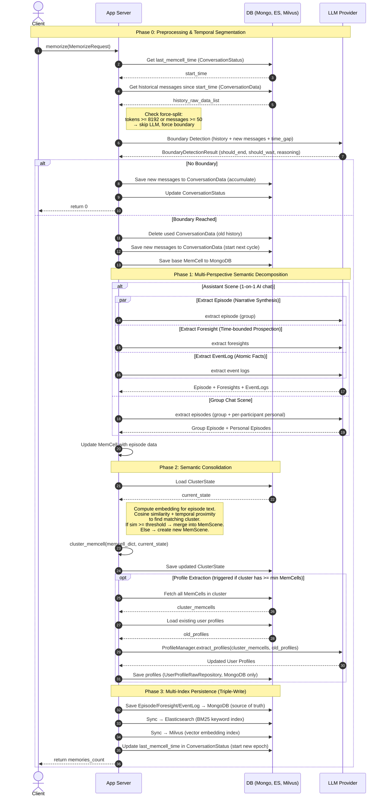

# Data Flow Diagrams for EverMemOS

We just focus on the insertion part.

## Components
- **App Server**: Python FastAPI application. All orchestration logic: boundary detection coordination, extraction dispatch, clustering, persistence orchestration.
- **DB**: All persistent storage. MongoDB (source of truth for MemCells, Episodes, Foresight, EventLog, Profiles, ConversationStatus, ConversationData, ClusterState), Elasticsearch (BM25 keyword index), Milvus (vector embedding index).
- **LLM**: External LLM API provider. Stateless; called for boundary detection, episode synthesis, foresight generation, event log extraction, profile distillation.

### Diagrams



## Data Schemas

All data lives in MongoDB. Elasticsearch and Milvus are **secondary indexes** — they store copies of the same data in different formats for retrieval (BM25 keyword search and vector similarity search). Only Episode, Foresight, and EventLog are triple-written; Profile and ClusterState are MongoDB-only.

### ConversationStatus
**Collection**: `conversation_status` · **Purpose**: Tracks the segmentation epoch — where the last MemCell cut happened.

| Field | Type | Description |
|---|---|---|
| group_id | string | Unique identifier for the conversation group |
| last_memcell_time | datetime | Timestamp of the last segmentation boundary. Messages after this time are "accumulated" waiting for the next boundary |
| old_msg_start_time | datetime | Conversation window read start time |
| new_msg_start_time | datetime | Accumulated new conversation read start time |

### ConversationData
**Collection**: `conversation_data` · **Purpose**: Temporary buffer for accumulated messages between two segmentation boundaries (the "sliding window" content).

Each record is a single message, stored as a raw dict with fields like `content`, `speaker_id`, `speaker_name`, `timestamp`, `msgType`, etc.

### MemCell (Conversation Segment)
**Collection**: `memcells` · **Purpose**: One coherent conversation segment after boundary detection. The atomic memory unit. All downstream memories (Episode, Foresight, EventLog) are derived from it.

| Field | Type | Description |
|---|---|---|
| _id / event_id | ObjectId | Auto-generated unique ID |
| original_data | list[dict] | Raw messages in this segment (the conversation text) |
| timestamp | datetime | Timestamp of the last message in the segment |
| summary | string? | Short summary (from LLM boundary detection or empty for force-split) |
| subject | string? | Central topic (filled after Episode extraction) |
| episode | string? | Narrative text (filled after Episode extraction) |
| group_id | string? | Which conversation group |
| participants | list[string]? | Speaker IDs involved |
| type | enum | Always "Conversation" currently |
| keywords | list[string]? | Keywords |
| foresight_memories | list? | Embedded foresight data (rarely used directly) |
| event_log | dict? | Embedded event log data (rarely used directly) |

**Example**:
```json
{
  "_id": "678abc...",
  "original_data": [
    {"speaker_name": "Alice", "content": "I will go to Beijing next week", "timestamp": "2025-01-15T10:00:00Z"},
    {"speaker_name": "Bob", "content": "Really? I was there last month!", "timestamp": "2025-01-15T10:01:00Z"}
  ],
  "timestamp": "2025-01-15T10:01:00Z",
  "summary": "Alice plans a trip to Beijing; Bob shares recent experience",
  "subject": "Beijing Travel Planning",
  "episode": "On Jan 15, Alice mentioned an upcoming trip to Beijing. Bob shared that he visited Beijing recently...",
  "group_id": "group_friends",
  "participants": ["alice_001", "bob_002"]
}
```

### EpisodeMemory (Narrative Summary)
**Collection**: `episodic_memories` · **Also in**: Elasticsearch (`episodic_memories` index) + Milvus (vector collection)
**Purpose**: A concise third-person narrative synthesized from a MemCell. One MemCell → one group Episode + optionally one personal Episode per participant.

| Field | Type | Description |
|---|---|---|
| user_id | string? | null = group episode; "alice_001" = Alice's personal perspective |
| episode | string | The narrative text (e.g., "Alice is planning a trip to Beijing next week...") |
| summary | string | Short summary |
| subject | string? | Central topic |
| timestamp | datetime | When it happened |
| participants | list[string]? | People involved |
| group_id | string? | Group identifier |
| memcell_event_id_list | list[string]? | Which MemCell(s) this was derived from |
| vector | list[float]? | Embedding vector (for Milvus) |

### ForesightRecord (Future Prediction)
**Collection**: `foresight_records` · **Also in**: ES + Milvus
**Purpose**: Time-bounded predictions or planned actions extracted from conversation. Only in assistant (1-on-1 AI) scene.

| Field | Type | Description |
|---|---|---|
| content | string | The prediction text (e.g., "User will travel to Beijing next week") |
| evidence | string? | Supporting evidence from conversation |
| start_time | string? | When this foresight becomes relevant (e.g., "2025-01-20") |
| end_time | string? | When this foresight expires (e.g., "2025-01-27") |
| duration_days | int? | Validity duration |
| parent_type | enum | "memcell" or "episode" — what this was derived from |
| parent_id | string | ID of the parent MemCell/Episode |
| user_id | string? | Whose foresight |
| vector | list[float]? | Embedding vector |

### EventLogRecord (Atomic Fact)
**Collection**: `event_log_records` · **Also in**: ES + Milvus
**Purpose**: Discrete, atomic factual events extracted from conversation. Only in assistant scene.

| Field | Type | Description |
|---|---|---|
| atomic_fact | string | Single factual sentence (e.g., "Alice went to Chengdu on Jan 1, 2024") |
| timestamp | datetime | When the event happened |
| parent_type | enum | "memcell" or "episode" |
| parent_id | string | ID of parent |
| user_id | string? | Whose fact |
| vector | list[float]? | Embedding vector |

### ClusterState (Thematic Grouping State)
**Collection**: `cluster_states` (MongoDB only) · **Purpose**: Tracks incremental semantic clustering of MemCells into thematic groups (called "MemScenes" in the paper).

| Field | Type | Description |
|---|---|---|
| event_ids | list[string] | All MemCell IDs that have been clustered |
| eventid_to_cluster | dict[string→string] | Mapping: MemCell event_id → cluster_id |
| cluster_centroids | dict[string→list[float]] | Each cluster's centroid embedding vector (incrementally updated) |
| cluster_counts | dict[string→int] | Number of MemCells in each cluster |
| cluster_last_ts | dict[string→float] | Last timestamp in each cluster (for temporal proximity check) |
| next_cluster_idx | int | Counter for generating new cluster IDs (cluster_000, cluster_001, ...) |

**Example**:
```json
{
  "event_ids": ["678abc", "678def", "679ghi"],
  "eventid_to_cluster": {"678abc": "cluster_000", "678def": "cluster_000", "679ghi": "cluster_001"},
  "cluster_centroids": {"cluster_000": [0.12, -0.34, ...], "cluster_001": [0.56, 0.78, ...]},
  "cluster_counts": {"cluster_000": 2, "cluster_001": 1},
  "cluster_last_ts": {"cluster_000": 1705305600.0, "cluster_001": 1705392000.0},
  "next_cluster_idx": 2
}
```

### UserProfile (Distilled User Traits)
**Collection**: `user_profiles` (MongoDB only, no ES/Milvus) · **Purpose**: Stable user characteristics distilled from clustered MemCells. Only extracted when a cluster has accumulated enough MemCells (>= threshold).

| Field | Type | Description |
|---|---|---|
| user_id | string | Which user |
| hard_skills | list[dict]? | e.g., `[{"value": "Python", "level": "advanced", "evidences": ["2025-01-15|conv_123"]}]` |
| soft_skills | list[dict]? | Communication, leadership, etc. |
| personality | list[dict]? | Personality traits |
| interests | list[dict]? | Hobbies and interests |
| motivation_system | list[dict]? | What drives the user |
| value_system | list[dict]? | Core values |
| projects_participated | list[dict]? | Project involvement |
| work_responsibility | list[dict]? | Job responsibilities |
| working_habit_preference | list[dict]? | Work style preferences |

Each trait entry follows the pattern: `{"value": "...", "evidences": ["date|conversation_id", ...]}` — traits are evidence-backed.

### Storage Summary

| Data | MongoDB Collection | Elasticsearch | Milvus | When Written |
|---|---|---|---|---|
| ConversationStatus | `conversation_status` | ✗ | ✗ | Every memorize() call |
| ConversationData | `conversation_data` | ✗ | ✗ | Every memorize() call (accumulate/clear) |
| MemCell | `memcells` | ✗ | ✗ | On boundary detection |
| Episode | `episodic_memories` | ✓ | ✓ | After extraction |
| Foresight | `foresight_records` | ✓ | ✓ | After extraction (assistant only) |
| EventLog | `event_log_records` | ✓ | ✓ | After extraction (assistant only) |
| ClusterState | `cluster_states` | ✗ | ✗ | After clustering |
| UserProfile | `user_profiles` | ✗ | ✗ | After profile distillation |

## High-Level Semantic Queries

```sql
-- =====================================================
-- EverMemOS Insertion Workflow as Semantic Queries
-- =====================================================
-- Naming conventions:
--   Recent*   = just produced from current message segment (temp tables)
--   History*  = persisted in DB from previous interactions
--   *SlidingWindow = accumulated message buffer between boundaries


-- =============================================================
-- Phase 0: Temporal Segmentation
-- Goal: segment the continuous message stream at semantic
--        boundaries into coherent conversational segments
-- =============================================================

-- step 0.1: retrieve accumulated messages since last segmentation
create temp table MessageSlidingWindow as
select *
from HistoryMessages                -- DB: conversation_data
where group_id = :group_id
  and created_at > (select last_segmentation_time
                    from SegmentationState   -- DB: conversation_status
                    where group_id = :group_id);

-- step 0.2: detect semantic boundary
-- asks: "has the conversation reached a natural break point?"
create temp table BoundaryDecision as
select
    sem_filter(
        MessageSlidingWindow.content, :new_message,
        "Has the current conversational episode reached a natural boundary "
        "(topic shift, long time gap, or logical conclusion)?"
    ) as is_boundary;
-- deterministic guard (bypass LLM):
--   is_boundary := true if tokens >= 8192 or messages >= 50

-- if NOT is_boundary → append new message to HistoryMessages, return 0
-- if is_boundary → proceed: the sliding window forms one segment


-- =============================================================
-- Phase 1: Multi-Perspective Semantic Decomposition
-- Goal: decompose the segment into structured memories
--        from multiple cognitive perspectives
-- =============================================================

-- step 1.0: seal the sliding window into a persistent segment
insert into HistorySegments              -- DB: memcells
select * from MessageSlidingWindow;

-- step 1.1: narrative synthesis
-- asks: "synthesize this conversation into a third-person narrative"
create temp table RecentEpisode as
select
    sem_map(
        RecentMessageSegment.content,
        "Synthesize this conversation into a concise third-person "
        "episodic narrative capturing the key events and context"
    ) as episode,
    sem_map(
        RecentMessageSegment.content,
        "What is the central subject of this conversation?"
    ) as subject
from RecentMessageSegment;              -- i.e., the just-sealed segment

-- step 1.2: time-bounded prospection (assistant scene only)
-- asks: "what future actions or predictions are implied?"
create temp table RecentForesights as
select
    sem_extract(
        RecentMessageSegment.content,
        "Extract time-bounded future predictions, planned actions, "
        "or upcoming events mentioned or implied in this conversation"
    ) as (foresight, evidence, start_time, end_time);

-- step 1.3: atomic fact extraction (assistant scene only)
-- asks: "what discrete factual events occurred?"
create temp table RecentFacts as
select
    sem_extract(
        RecentMessageSegment.content,
        "Extract discrete atomic factual events "
        "(who did what, when, with specific details)"
    ) as (fact, timestamp);

-- note: in assistant scene, steps 1.1 / 1.2 / 1.3 run in parallel
-- note: in group chat scene, only step 1.1 runs (no foresight/facts),
--        and episode extraction runs for group + each participant


-- =============================================================
-- Phase 2: Semantic Consolidation
-- Goal: assign the segment to a topic cluster, and distill
--        stable user traits if enough evidence has accumulated
-- =============================================================

-- step 2.1: incremental topic clustering
-- asks: "which existing topic does this episode belong to?"
create temp table TopicAssignment as
select
    coalesce(
        (select topic_id
         from TopicState                   -- DB: cluster_states
         where sem_sim_join(
             RecentEpisode.episode, TopicState.centroid_embedding,
             "Does this new episode belong to the same thematic storyline?"
         ) = true
         and time_gap(TopicState.last_timestamp, :now) < :max_gap_days
         limit 1),
        new_topic_id()                     -- no match → create new topic
    ) as topic_id;

-- step 2.2: conditional profile distillation
-- asks: "given all episodes in this topic, what user traits can be distilled?"
-- (only triggered when topic has >= threshold segments)
create temp table RecentProfiles as
select
    sem_agg(
        TopicSegments.episode,
        HistoryProfiles.traits,
        "Given the existing user profile and these conversational episodes, "
        "distill updated stable user traits: preferences, habits, "
        "personality characteristics, factual attributes"
    ) as traits,
    TopicSegments.user_id
from
    HistorySegments as TopicSegments     -- all segments in the matched topic
    left join HistoryProfiles            -- DB: user_profiles
        on TopicSegments.user_id = HistoryProfiles.user_id
where TopicSegments.topic_id = TopicAssignment.topic_id
  and (select count(*) from HistorySegments
       where topic_id = TopicAssignment.topic_id)
      >= :profile_min_segments;

upsert into HistoryProfiles (user_id, traits)
select user_id, traits from RecentProfiles;


-- =============================================================
-- Phase 3: Persistence
-- Goal: persist extracted memories to DB
--       (triple-written to MongoDB + Elasticsearch + Milvus)
-- =============================================================

insert into HistoryEpisodes    select * from RecentEpisode;
insert into HistoryForesights  select * from RecentForesights;   -- assistant only
insert into HistoryFacts       select * from RecentFacts;        -- assistant only
-- triple-write: each insert writes to MongoDB (source of truth),
--   then syncs to Elasticsearch (BM25 keyword index)
--   and Milvus (vector embedding index)
-- profiles are MongoDB-only (no ES/Milvus sync)

-- advance segmentation epoch
update SegmentationState
set last_segmentation_time = :now
where group_id = :group_id;
```
