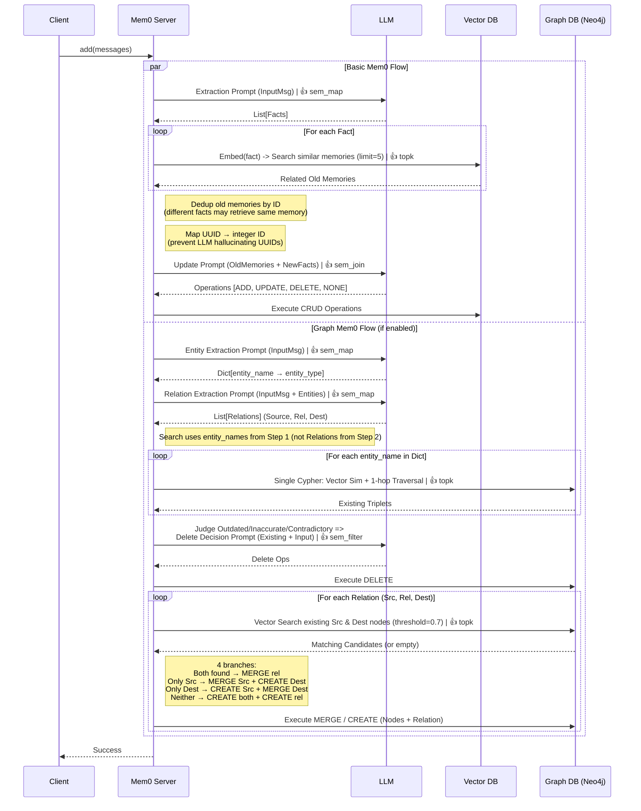
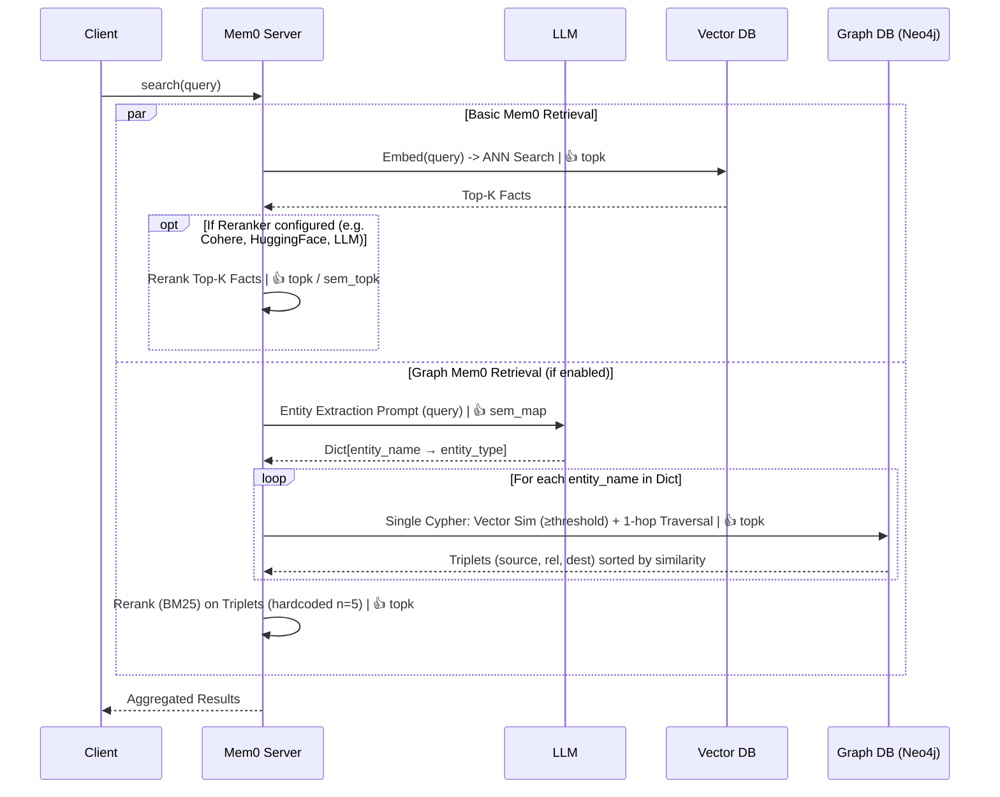

# Data Flow Diagrams for Mem0

## Memory Update

```mermaid
sequenceDiagram
    participant Client
    participant Server as Mem0 Server
    participant LLM
    participant VecDB as Vector DB
    participant GraphDB as Graph DB (Neo4j)

    Client->>Server: add(messages)
    
    par Basic Mem0 Flow
        Server->>LLM: Extraction Prompt (InputMsg) | 👍 sem_map
        LLM-->>Server: List[Facts]
        
        loop For each Fact
            Server->>VecDB: Embed(fact) -> Search similar memories (limit=5) | 👍 topk
            VecDB-->>Server: Related Old Memories
        end

        Note right of Server: Dedup old memories by ID<br/>(different facts may retrieve same memory)
        Note right of Server: Map UUID → integer ID<br/>(prevent LLM hallucinating UUIDs)

        Server->>LLM: Update Prompt (OldMemories + NewFacts) | 👍 sem_join
        LLM-->>Server: Operations [ADD, UPDATE, DELETE, NONE]
        
        Server->>VecDB: Execute CRUD Operations
    and Graph Mem0 Flow (if enabled)
        Server->>LLM: Entity Extraction Prompt (InputMsg) | 👍 sem_map
        LLM-->>Server: Dict[entity_name → entity_type]
        
        Server->>LLM: Relation Extraction Prompt (InputMsg + Entities) | 👍 sem_map
        LLM-->>Server: List[Relations] (Source, Rel, Dest)
        
        Note right of Server: Search uses entity_names from Step 1 (not Relations from Step 2)
        loop For each entity_name in Dict
            Server->>GraphDB: Single Cypher: Vector Sim + 1-hop Traversal | 👍 topk
            GraphDB-->>Server: Existing Triplets
        end
        
        Server->>LLM: Judge Outdated/Inaccurate/Contradictory => <br/> Delete Decision Prompt (Existing + Input) | 👍 sem_filter
        LLM-->>Server: Delete Ops
        Server->>GraphDB: Execute DELETE
        
        loop For each Relation (Src, Rel, Dest)
            Server->>GraphDB: Vector Search existing Src & Dest nodes (threshold=0.7) | 👍 topk
            GraphDB-->>Server: Matching Candidates (or empty)
            Note right of Server: 4 branches:<br/>Both found → MERGE rel<br/>Only Src → MERGE Src + CREATE Dest<br/>Only Dest → CREATE Src + MERGE Dest<br/>Neither → CREATE both + CREATE rel
            Server->>GraphDB: Execute MERGE / CREATE (Nodes + Relation)
        end
    end
    
    Server-->>Client: Success
```

## Memory Search

```mermaid
sequenceDiagram
    participant Client
    participant Server as Mem0 Server
    participant LLM
    participant VecDB as Vector DB
    participant GraphDB as Graph DB (Neo4j)

    Client->>Server: search(query)

    par Basic Mem0 Retrieval
        Server->>VecDB: Embed(query) -> ANN Search | 👍 topk
        VecDB-->>Server: Top-K Facts
        opt If Reranker configured (e.g. Cohere, HuggingFace, LLM)
            Server->>Server: Rerank Top-K Facts | 👍 topk / sem_topk
        end
    and Graph Mem0 Retrieval (if enabled)
        Server->>LLM: Entity Extraction Prompt (query) | 👍 sem_map
        LLM-->>Server: Dict[entity_name → entity_type]
        
        loop For each entity_name in Dict
            Server->>GraphDB: Single Cypher: Vector Sim (≥threshold) + 1-hop Traversal | 👍 topk
            GraphDB-->>Server: Triplets (source, rel, dest) sorted by similarity
        end
        
        Server->>Server: Rerank (BM25) on Triplets (hardcoded n=5) | 👍 topk
    end
    
    Server-->>Client: Aggregated Results
```
