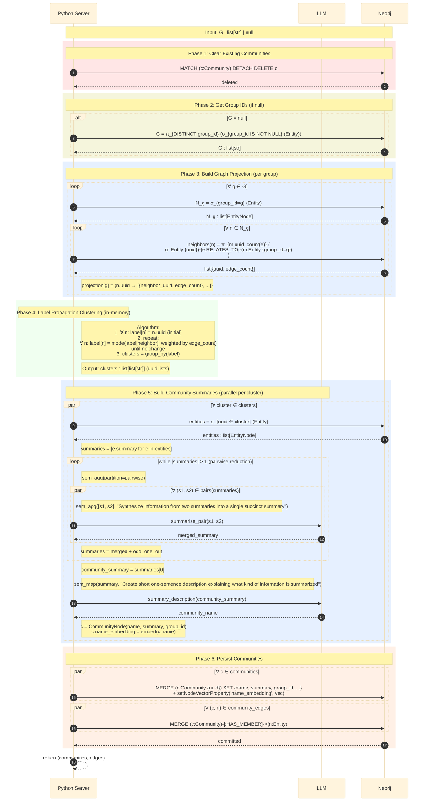

# Graphiti Data Flow - Relational Algebra Notation

data flow of Graphiti operations using relational algebra notation.

---

## 1. add_episode(m, g, t) - Insert Flow

### Input
- `m : text` - Raw message content
- `g : str` - Group ID
- `t : datetime` - Reference time (valid_at)

### Output
- `AddEpisodeResults(episode, nodes, edges, communities)`


### Flow Diagram



```mermaid
%%{init: {'theme': 'base', 'themeVariables': { 'width': '100%' }}}%%
sequenceDiagram
    autonumber
    participant Py as Python Server
    participant LLM as LLM
    participant Neo4j as Neo4j

    Note over Py, Neo4j: Input: m : text, g : str, t : datetime

    rect rgb(245, 245, 220)
        Note over Py, Neo4j: Phase 1: Context Retrieval
        Py->>Neo4j: E_prev = τ_{created_at↓} (σ_{group_id=g} (Episodic)) [LIMIT 10]
        Neo4j-->>Py: E_prev : list[EpisodicNode]
        Note right of Py: e = EpisodicNode(content=m, group_id=g, valid_at=t)<br/>(in-memory, uuid generated)
    end

    rect rgb(230, 240, 255)
        Note over Py, LLM: Phase 2: Entity Extraction
        Py->>LLM: extract_nodes(m, E_prev): <br/> sem_map((m, E_prev), "Extract entity nodes mentioned explicitly or implicitly in CURRENT MESSAGE")
        LLM-->>Py: N_ext : list[{name, type_id}]
        Note right of Py: Convert to EntityNode objects<br/>N_raw : list[EntityNode]
    end

    rect rgb(245, 245, 220)
        Note over Py, Neo4j: Phase 3: Entity Deduplication
        par ∀ n ∈ N_raw (parallel hybrid search)
            Py->>Neo4j: C_n = RRF(<br/>  FTS('node_name_and_summary', n.name, g) [LIMIT 2k],<br/>  τ_{score↓}(σ_{score>0.6}(Entity ⊗_{cosine(name_embedding, embed(n.name))})) [LIMIT 2k]<br/>)
            Neo4j-->>Py: C_n : list[EntityNode]
        end
        Note right of Py: C_all = dedupe(⋃ C_n)
        alt |C_all| > 0 ∧ ∃ unresolved
            Py->>LLM: dedupe_nodes(N_raw, C_all, m, E_prev) → single LLM call:<br/>sem_join(N_raw × C_all, "Does entity refer to the same real-world object or concept as existing?")
            LLM-->>Py: R : list[{id, name, duplicate_idx}]
        end
        Note right of Py: Build uuid_map: new_uuid → existing_uuid<br/>N : list[EntityNode] (resolved)
    end

    rect rgb(230, 240, 255)
        Note over Py, LLM: Phase 4: Edge Extraction
        Py->>LLM: extract_edges(m, N_raw, E_prev): <br/> sem_map((m, N, E_prev, t), "Extract all factual relationships between ENTITIES based on CURRENT MESSAGE")
        LLM-->>Py: F_ext : list[{src_id, tgt_id, relation, fact, valid_at}]
        Note right of Py: Convert to EntityEdge, remap UUIDs<br/>F_raw : list[EntityEdge]
    end

    rect rgb(245, 245, 220)
        Note over Py, Neo4j: Phase 5: Edge Deduplication
        Note right of Py: ∀ f ∈ F_raw: f.fact_embedding = embed(f.fact)
        par ∀ f ∈ F_raw (get edges between same nodes)
            Py->>Neo4j: E_between = σ_{src=f.src ∧ tgt=f.tgt} (RELATES_TO)
            Neo4j-->>Py: E_between : list[EntityEdge]
        end
        par ∀ f ∈ F_raw (hybrid search for related, filtered by E_between)
            Py->>Neo4j: C_f = RRF(<br/>  FTS('edge_name_and_fact', f.fact, g) [LIMIT k],<br/>  τ_{score↓}(σ_{score>0.6 ∧ uuid∈E_between}(RELATES_TO ⊗_{cosine(fact_embedding, f.embedding)})) [LIMIT k]<br/>)
            Neo4j-->>Py: C_f : list[EntityEdge] (related)
        end
        par ∀ f ∈ F_raw (hybrid search for invalidation, no filter)
            Py->>Neo4j: I_f = RRF(<br/>  FTS('edge_name_and_fact', f.fact, g) [LIMIT k],<br/>  τ_{score↓}(σ_{score>0.6}(RELATES_TO ⊗_{cosine(fact_embedding, f.embedding)})) [LIMIT k]<br/>)
            Neo4j-->>Py: I_f : list[EntityEdge] (invalidation candidates)
        end
        par ∀ f : |C_f| > 0 (parallel LLM calls per edge)
            Py->>LLM: dedupe_edge(f.fact, C_f, I_f): <br/>sem_join({f} × C_f, "Does NEW FACT represent identical factual information as EXISTING FACT?")<br/>sem_filter(I_f, "Does NEW FACT contradict EXISTING FACT?")
            LLM-->>Py: {duplicate_facts[], contradicted_facts[]}
        end
        Note right of Py: F : list[EntityEdge] (new/updated)<br/>F_inv : list[EntityEdge] (invalidated)
    end

    rect rgb(230, 240, 255)
        Note over Py, LLM: Phase 6: Summary Generation
        par ∀ n ∈ N (parallel)
            Py->>LLM: extract_summary(n, m, E_prev): <br/>sem_map((n, m, E_prev), "Update summary combining relevant information about ENTITY from MESSAGES")
            LLM-->>Py: n.summary : str
        end
        Note right of Py: ∀ n ∈ N: n.name_embedding = embed(n.name)
    end

    rect rgb(255, 240, 230)
        Note over Py, Neo4j: Phase 7: Persist to DB
        Py->>Neo4j: MERGE (e:Episodic {uuid}) SET {content, group_id, valid_at, ...}
        Py->>Neo4j: ∀ n ∈ N: MERGE (n:Entity {uuid}) SET {name, summary, ...}<br/>+ setNodeVectorProperty('name_embedding', vec)
        Py->>Neo4j: ∀ n ∈ N: MERGE (e:Episodic)-[:MENTIONS]->(n:Entity)
        Py->>Neo4j: ∀ f ∈ (F ∪ F_inv): MERGE (src)-[r:RELATES_TO {uuid}]->(tgt)<br/>SET {fact, valid_at, invalid_at, ...}<br/>+ setRelationshipVectorProperty('fact_embedding', vec)
        Neo4j-->>Py: committed
    end

    rect rgb(240, 255, 240)
        Note over Py, Neo4j: Phase 8: Community Update (optional)
        opt update_communities = True
            par ∀ n ∈ N (parallel)
                Py->>Neo4j: c_exist = σ_{(c)-[:HAS_MEMBER]->(n)} (Community)
                Neo4j-->>Py: c_exist : CommunityNode | null
                alt c_exist = null
                    Py->>Neo4j: C_neighbor = π_Community (σ_{(c)-[:HAS_MEMBER]->(m)-[:RELATES_TO]-(n)} (Community))
                    Neo4j-->>Py: C_neighbor : list[CommunityNode]
                    Note right of Py: c = mode(C_neighbor) — most frequent
                end
                alt c ≠ null
                    Py->>LLM: summarize_pair(n.summary, c.summary): <br/>sem_agg([n.summary, c.summary], "Synthesize information from two summaries into a single succinct summary")
                    LLM-->>Py: c.summary_new
                    Py->>LLM: summary_description(c.summary_new): <br/>sem_map(c.summary_new, "Create short one-sentence description explaining what kind of information is summarized")
                    LLM-->>Py: c.name_new
                    Note right of Py: c.name_embedding = embed(c.name_new)
                    Py->>Neo4j: MERGE (c:Community {uuid}) SET {name, summary, ...}<br/>+ setNodeVectorProperty('name_embedding', vec)
                    opt is_new = True (from neighbor)
                        Py->>Neo4j: MERGE (c)-[:HAS_MEMBER]->(n)
                    end
                end
            end
        end
    end

    Py-->>Py: return AddEpisodeResults(episode=e, nodes=N, edges=F∪F_inv, communities=...)
```

High Level queries:
```sql
-- context retrieval
-- related zep steps: phase 1
select 
    string_agg(content, '\n') as content, max(created_at) as created_at
from (
    (select * from Episodes order by created_at desc limit L) -- L=20
    union current_message
) as RecentEpisodes; -- better use 'create temp table'

-- entity resolution & state update
-- related zep steps: phases 2, 3, 6, part of 7
upsert into HistoryEntities (uuid, name, summary, time) -- in high level: id can be ignored
select
    -- if join matches, use existing uuid, else use extracted uuid
    coalesce(HistoryEntities.uuid, generate_uuid()) as uuid,
    RecentEntities.name,
    -- if join matches, use aggregated summary, else use extracted summary
    -- not sem_agg, cuz this is column-wise operation
    sem_map(HistoryEntities.summary, RecentEntities.summary, RecentEpisodes.content, "Update summary with new info") as summary, -- sem_map/extract: 
    RecentEpisodes.created_at as time -- actually currentmsg.created_at
from
    -- left table: extracted entities
    sem_map(
        RecentEpisodes.content,
        "Extract entity nodes mentioned explicitly or implicitly in CURRENT MESSAGE"
    ) as RecentEntities(name, summary) -- or sem_extract(...)as RecentEntities(name, summary) in LOTUS
    cross join RecentEpisodes -- one row
    -- right table: existing entities
    left sem_join HistoryEntities -- resolution join
    on (RecentEntities.name, HistoryEntities.name, RecentEpisodes.content, 
        "Do ENTITY and DATABASE ENTITY refer to the same real-world object?");
    -- i.e., on (RecentEntities.name = HistoryEntities.name)
as ResolvedRecentEntities; -- better use 'create temp table'

-- fact delta management
-- related zep steps: phases 4, 5, part of 7
with RecentFacts as (
    select * from (
        sem_map(
            (select content from RecentEpisodes), (select array_agg(name) from ResolvedRecentEntities), 
            "Extract all factual relationships between ENTITIES based on CURRENT MESSAGE"
        ) -- can be sem_extract in LOTUS
        -- data schema: {uuid, src_uuid, tgt_uuid, fact, valid_at}
    )
),
-- dup and contradictory detection: cannot be merged?
--    Finding dup and contradictions are 2 independent mapping networks:
--    A new fact can either be not inserted (duplicates Fact A) or trigger an operation that invalidates Fact B.
--    Also, one "LEFT JOIN + CASE" can cause fanout: one RecentFact can match multiple HistoryFacts.
-- Duplicate Detection (Strict Topology: same src AND tgt)
--    Question: do we really need that strict topology constraint? 
--    I think zep use this just for saving costs
--    THEN: if they have the same topology constraint, we can use window fuction/groupby to merge the queries
DuplicateFactsMatched as (
    select
        RecentFacts.uuid,
        HistoryFacts.uuid as dup_history_fact_uuid
    from
        RecentFacts
    inner sem_join HistoryFacts
    on (RecentFacts.src_uuid = HistoryFacts.src_uuid and RecentFacts.tgt_uuid = HistoryFacts.tgt_uuid)
    and "Does NEW FACT represent identical factual information as EXISTING FACT?"
),
-- Contradictory Detection (Loose Topology: same src OR tgt)
-- e.g. (Alice) -[LIVES_IN]-> (LA) vs (Alice) -[RESIDES_IN]-> (NY)
ContradictionFactsMatched as (
    select
        RecentFacts.uuid,
        HistoryFacts.uuid as contradiction_history_fact_uuid
    from
        RecentFacts
    inner sem_join HistoryFacts
    on HistoryFacts.invalid_at is null
    and "Does NEW FACT contradict EXISTING FACT?"
)

-- not good to be upsert: update and insert different rows
insert into HistoryFacts (uuid, src_uuid, tgt_uuid, fact, time) -- in high level: id can be ignored
select
    -- if join matches, use existing uuid, else use extracted uuid
    generate_uuid() as uuid, RecentFacts.src_uuid, RecentFacts.tgt_uuid, RecentFacts.fact, RecentEpisodes.created_at
from RecentFacts
cross join RecentEpisodes -- one row
where uuid not in (select uuid from DuplicateFactsMatched);
-- also, zep updates EXISTING facts that were DUPLICATED

update HistoryFacts
set invalid_at = (select created_at from RecentEpisodes)
where uuid in (select contradiction_history_fact_uuid from ContradictionFactsMatched);

-- community update
-- related zep steps: part of 7
-- schema: HistoryCommunities (uuid, name, summary, time), HistoryCommunityMembership (community_uuid, entity_uuid, time)
with RecentCommunitiesFromEntities as (
    select
        ResolvedRecentEntities.uuid as entity_uuid,
        ResolvedRecentEntities.summary as entity_summary,
        -- logic: if there's a community, use it; otherwise, look for neighbors' communities
        coalesce(
            HistoryCommunityMembership.community_uuid,
            infer_dominant_community_from_entity_neighbors(ResolvedRecentEntities.uuid)
        ) as recent_community_uuid
    from ResolvedRecentEntities
    left join HistoryCommunityMembership -- standard relational join, no semantic outer join
    on ResolvedRecentEntities.uuid = HistoryCommunityMembership.entity_uuid
),
-- ⚠️ Zep's Flaw: Per-Entity Iteration (No GROUP BY)
-- This mimics the "par ∀ n ∈ N" loop in the Zep workflow. 
-- If N entities map to the same community, this produces N distinct fusion rows.
LatestRecentCommunitiesFromEntities as (
    select
        RecentCommunitiesFromEntities.recent_community_uuid,
        RecentCommunitiesFromEntities.entity_uuid,
        sem_map(
            HistoryCommunities.summary, RecentCommunitiesFromEntities.entity_summary, 
            "Synthesize information from two summaries into a single succinct summary"
        ) as latest_community_summary
    from RecentCommunitiesFromEntities
    left join HistoryCommunities
    on RecentCommunitiesFromEntities.recent_community_uuid = HistoryCommunities.uuid
    where RecentCommunitiesFromEntities.recent_community_uuid is not null
)

-- ⚠️ Zep's Race Condition: N-to-1 Update without aggregation
-- updating one target row from multiple source rows results in undefined behavior (Last-Write-Wins). 
update HistoryCommunities
set
    name = sem_map(LatestRecentCommunitiesFromEntities.latest_community_summary, 
    "Create short one-sentence description explaining what kind of information is summarized"),
    summary = LatestRecentCommunitiesFromEntities.latest_community_summary,
    time = RecentEpisodes.created_at
from LatestRecentCommunitiesFromEntities
cross join RecentEpisodes -- one row
where HistoryCommunities.uuid = LatestRecentCommunitiesFromEntities.recent_community_uuid;

insert into HistoryCommunityMembership (community_uuid, entity_uuid, time)
select
    RecentCommunitiesFromEntities.recent_community_uuid,
    RecentCommunitiesFromEntities.entity_uuid,
    RecentEpisodes.created_at
from RecentCommunitiesFromEntities
cross join RecentEpisodes -- one row
where RecentCommunitiesFromEntities.recent_community_uuid is not null;

-- draft solution: 
-- 1. Explicit Array Collection + Scalar Semantic Map: apply a GROUP BY clause on the target community_uuid and use the relational collect() function to gather all newly assigned entity summaries into a single array. Subsequently, we utilize a scalar sem_map operator to fuse the existing community summary with this array of new summaries in a single LLM invocation
-- 2. Pure Semantic Aggregation: directly apply a GROUP BY community_uuid and utilize sem_agg to perform a cross-row semantic reduction


-----------------------------------------------------------------------------------------------
-- P.S.: queries of facts if topology constraints of dup and contradict is the same:
-- -- 1. Single Join produces fanout and determines all states at the same time
-- with FactFanOutState as (
--     select 
--         RecentFacts.uuid,
--         RecentFacts.src_uuid, RecentFacts.tgt_uuid, RecentFacts.fact,
--         HistoryFacts.uuid as history_uuid,
--         sem_filter(..., "Is Duplicate?") as is_dup,
--         sem_filter(..., "Is Contradictory?") as is_contra
--     from RecentFacts
--     left sem_join HistoryFacts 
--     on RecentFacts.src_uuid = HistoryFacts.src_uuid
-- ),
-- -- 2. use window function (OVER PARTITION) to solve the "multiple identity" aggregation problem
-- FactDecisions as (
--     select 
--         *,
--         -- core logic: if there's any duplicate in the fanout, then it's a duplicate
--         MAX(CAST(is_dup as INT)) over (partition by fact_id) as has_any_duplicate
--     from FactFanOutState
-- )

-- -- 3. Side Effect 1: Insert
-- -- only insert if it's not a duplicate
-- insert into HistoryFacts (uuid, src_uuid, tgt_uuid, fact)
-- select generate_uuid(), src_uuid, tgt_uuid, fact
-- from FactDecisions
-- where has_any_duplicate = 0
-- group by fact_id, src_uuid, tgt_uuid, fact; -- deduplication

-- -- 4. Side Effect 2: Update Invalidate
-- update HistoryFacts
-- set invalid_at = NOW()
-- where uuid in (select history_uuid from FactDecisions where is_contra = true);
```

---

## 2. search(q, G, cfg) - Search Flow

### Input
- `q : text` - Search query
- `G : list[str] | null` - Group IDs to search (null = all groups)
- `cfg : SearchConfig` - Configuration for search methods and rerankers

### Output
- `SearchResults(edges, nodes, episodes, communities, scores)`

### Flow Diagram



```mermaid
%%{init: {'theme': 'base', 'themeVariables': { 'width': '100%' }}}%%
sequenceDiagram
    autonumber
    participant Py as Python Server
    participant LLM as LLM/CrossEncoder
    participant Neo4j as Neo4j

    Note over Py, Neo4j: Input: q : text, G : list[str] | null, cfg : SearchConfig

    rect rgb(245, 245, 220)
        Note over Py: Phase 1: Query Embedding
        alt cfg requires cosine similarity or MMR
            Note right of Py: q_vec = embed(q) : list[float] (384-dim)
        else
            Note right of Py: q_vec = [0.0] * 384 (placeholder)
        end
    end

    rect rgb(230, 240, 255)
        Note over Py, Neo4j: Phase 2: Parallel Search (4 concurrent searches)
        par edge_search (if cfg.edge_config ≠ null)
            alt BM25 ∈ cfg.edge_config.search_methods
                Py->>Neo4j: E_bm25 = FTS('edge_name_and_fact', q, G) [LIMIT 2k]
                Neo4j-->>Py: E_bm25 : list[EntityEdge]
            end
            alt cosine ∈ cfg.edge_config.search_methods
                Py->>Neo4j: E_cos = τ_{score↓}(σ_{score>θ ∧ group_id∈G}(<br/>  RELATES_TO ⊗_{cosine(fact_embedding, q_vec)}<br/>)) [LIMIT 2k]
                Neo4j-->>Py: E_cos : list[EntityEdge]
            end
            alt BFS ∈ cfg.edge_config.search_methods
                Py->>Neo4j: E_bfs = (origin)-[:RELATES_TO|MENTIONS*1..d]->(Entity)-[e:RELATES_TO]->() [LIMIT 2k]
                Neo4j-->>Py: E_bfs : list[EntityEdge]
            end
            Note right of Py: E_all = dedupe(E_bm25 ∪ E_cos ∪ E_bfs)
        and node_search (if cfg.node_config ≠ null)
            alt BM25 ∈ cfg.node_config.search_methods
                Py->>Neo4j: N_bm25 = FTS('node_name_and_summary', q, G) [LIMIT 2k]
                Neo4j-->>Py: N_bm25 : list[EntityNode]
            end
            alt cosine ∈ cfg.node_config.search_methods
                Py->>Neo4j: N_cos = τ_{score↓}(σ_{score>θ ∧ group_id∈G}(<br/>  Entity ⊗_{cosine(name_embedding, q_vec)}<br/>)) [LIMIT 2k]
                Neo4j-->>Py: N_cos : list[EntityNode]
            end
            alt BFS ∈ cfg.node_config.search_methods
                Py->>Neo4j: N_bfs = (origin)-[:RELATES_TO|MENTIONS*1..d]->(n:Entity) [LIMIT 2k]
                Neo4j-->>Py: N_bfs : list[EntityNode]
            end
            Note right of Py: N_all = dedupe(N_bm25 ∪ N_cos ∪ N_bfs)
        and episode_search (if cfg.episode_config ≠ null)
            Py->>Neo4j: Ep_bm25 = FTS('episode_content', q, G) [LIMIT 2k]
            Neo4j-->>Py: Ep_bm25 : list[EpisodicNode]
            Note right of Py: Ep_all = Ep_bm25 (BM25 only, no cosine)
        and community_search (if cfg.community_config ≠ null)
            Py->>Neo4j: C_bm25 = FTS('community_name', q, G) [LIMIT 2k]
            Neo4j-->>Py: C_bm25 : list[CommunityNode]
            Py->>Neo4j: C_cos = τ_{score↓}(σ_{score>θ ∧ group_id∈G}(<br/>  Community ⊗_{cosine(name_embedding, q_vec)}<br/>)) [LIMIT 2k]
            Neo4j-->>Py: C_cos : list[CommunityNode]
            Note right of Py: C_all = dedupe(C_bm25 ∪ C_cos)
        end
    end

    rect rgb(240, 255, 240)
        Note over Py, LLM: Phase 3: Reranking (per result type)
        par Edge Reranking
            alt cfg.edge_config.reranker = RRF
                Note right of Py: E_ranked, scores = RRF([E_bm25, E_cos, E_bfs], θ)
            else cfg.edge_config.reranker = MMR
                Py->>Neo4j: vecs = π_{uuid, fact_embedding} (σ_{uuid∈E_all} (RELATES_TO))
                Neo4j-->>Py: vecs : dict[uuid, embedding]
                Note right of Py: E_ranked, scores = MMR(q_vec, vecs, λ, θ)
            else cfg.edge_config.reranker = cross_encoder
                Note right of Py: CrossEncoder impl: OpenAI/Gemini (LLM) or BGE (cross-encoder model)
                Note right of Py: sem_topk(k, E_all, "Rank by relevance to q") [if LLM-based]
                Py->>LLM: rank(q, [e.fact for e in E_all[:k]])
                LLM-->>Py: E_ranked, scores
            else cfg.edge_config.reranker = node_distance
                Py->>Neo4j: neighbors = σ_{(center)-[:RELATES_TO]-(n)} (E_all.source_nodes)
                Neo4j-->>Py: neighbors (score=1) vs non-neighbors (score=∞)
                Note right of Py: E_ranked = τ_{score↑}(E_all)
            else cfg.edge_config.reranker = episode_mentions
                Note right of Py: E_ranked = τ_{|e.episodes|↓}(RRF(E_all))
            end
        and Node Reranking
            alt cfg.node_config.reranker = RRF
                Note right of Py: N_ranked, scores = RRF([N_bm25, N_cos, N_bfs], θ)
            else cfg.node_config.reranker = MMR
                Py->>Neo4j: vecs = π_{uuid, name_embedding} (σ_{uuid∈N_all} (Entity))
                Neo4j-->>Py: vecs : dict[uuid, embedding]
                Note right of Py: N_ranked, scores = MMR(q_vec, vecs, λ, θ)
            else cfg.node_config.reranker = cross_encoder
                Note right of Py: CrossEncoder impl: OpenAI/Gemini (LLM) or BGE (cross-encoder model)
                Note right of Py: sem_topk(k, N_all, "Rank by relevance to q") [if LLM-based]
                Py->>LLM: rank(q, [n.name for n in N_all])
                LLM-->>Py: N_ranked, scores
            else cfg.node_config.reranker = episode_mentions
                Py->>Neo4j: counts = π_{n.uuid, count(*)} ((Episodic)-[:MENTIONS]->(n:Entity))
                Neo4j-->>Py: counts : dict[uuid, int]
                Note right of Py: N_ranked = τ_{count↓}(RRF(N_all))
            else cfg.node_config.reranker = node_distance
                Py->>Neo4j: neighbors = σ_{(center)-[:RELATES_TO]-(n)} (N_all)
                Neo4j-->>Py: neighbors (score=1) vs non-neighbors (score=∞)
                Note right of Py: N_ranked = τ_{score↑}(N_all)
            end
        and Episode Reranking
            alt cfg.episode_config.reranker = RRF
                Note right of Py: Ep_ranked, scores = RRF([Ep_bm25], θ)
            else cfg.episode_config.reranker = cross_encoder
                Note right of Py: CrossEncoder impl: OpenAI/Gemini (LLM) or BGE (cross-encoder model)
                Note right of Py: Ep_rrf = RRF([Ep_bm25])[:k]
                Note right of Py: sem_topk(k, Ep_rrf, "Rank by relevance to q") [if LLM-based]
                Py->>LLM: rank(q, [ep.content for ep in Ep_rrf])
                LLM-->>Py: Ep_ranked, scores
            end
        and Community Reranking
            alt cfg.community_config.reranker = RRF
                Note right of Py: C_ranked, scores = RRF([C_bm25, C_cos], θ)
            else cfg.community_config.reranker = MMR
                Py->>Neo4j: vecs = π_{uuid, name_embedding} (σ_{uuid∈C_all} (Community))
                Neo4j-->>Py: vecs : dict[uuid, embedding]
                Note right of Py: C_ranked, scores = MMR(q_vec, vecs, λ, θ)
            else cfg.community_config.reranker = cross_encoder
                Note right of Py: CrossEncoder impl: OpenAI/Gemini (LLM) or BGE (cross-encoder model)
                Note right of Py: sem_topk(k, C_all, "Rank by relevance to q") [if LLM-based]
                Py->>LLM: rank(q, [c.name for c in C_all])
                LLM-->>Py: C_ranked, scores
            end
        end
    end

    rect rgb(255, 240, 230)
        Note over Py: Phase 4: Apply Limit & Return
        Note right of Py: edges = E_ranked[:cfg.limit]<br/>nodes = N_ranked[:cfg.limit]<br/>episodes = Ep_ranked[:cfg.limit]<br/>communities = C_ranked[:cfg.limit]
    end

    Py-->>Py: return SearchResults(edges, nodes, episodes, communities, scores)
```

### Important Notes

1. **Episode search has NO cosine similarity** - only BM25 full-text search is available
2. **node_distance_reranker checks direct neighbors only** (depth=1), not shortest path
3. **episode_mentions_reranker** counts how many episodes mention each entity
4. **RRF formula**: `score[uuid] = Σ 1/(rank + k)` where k=1 (rank_const)
5. **MMR formula**: `mmr = λ * cosine(q, doc) + (λ-1) * max_sim(doc, selected)`


---

## 3. Optional: build_communities(group_ids) - Static Community Creation Flow

### Input
- `G : list[str] | null` - Group IDs to process (null = all groups)

### Output
- `(communities : list[CommunityNode], edges : list[CommunityEdge])`

### Flow Diagram



---

## Symbol Reference (AI-Generated)

### Relational Algebra Operators

| Symbol | Name | Meaning | SQL Equivalent |
|--------|------|---------|----------------|
| `σ` | Selection | Filter rows | `WHERE` |
| `π` | Projection | Select columns | `SELECT cols` |
| `τ↓` / `τ↑` | Sort | Order desc/asc | `ORDER BY ... DESC/ASC` |
| `⊗_{f}` | Cross product with score | Cartesian product with computed score | `CROSS JOIN` + computed column |
| `⋈` | Join | Natural/equi join | `JOIN` |
| `∪` | Union | Combine results | `UNION` |
| `∩` | Intersection | Common results | `INTERSECT` |
| `−` | Difference | Set difference | `EXCEPT` |

### Search & Aggregation Functions

| Symbol | Name | Meaning |
|--------|------|---------|
| `FTS(idx, q, G)` | Full-text search | BM25 search on index `idx` with query `q`, filtered by group_ids `G` |
| `cosine(v1, v2)` | Cosine similarity | Vector similarity between embeddings |
| `BFS(origins, d, G)` | Breadth-first search | Graph traversal from `origins` up to depth `d` |
| `RRF([...], θ)` | Reciprocal Rank Fusion | Rank fusion algorithm with min_score `θ` |
| `MMR(q_vec, vecs, λ, θ)` | Maximal Marginal Relevance | Diversity-aware reranking |
| `mode(X)` | Mode | Most frequent value in set `X` |
| `embed(text)` | Embedding | Convert text to vector (384-dim) |
| `[LIMIT k]` | Top-k | Return at most `k` results |

### LOTUS Semantic Operators

| Operator | Signature | Semantics | Langex Pattern |
|----------|-----------|-----------|----------------|
| `sem_map(l: X→Y)` | single row → new column | Projection generating new structured data | "Extract/Generate ... from input" |
| `sem_join(t: T, l: (X,Y)→Bool)` | two tables + predicate → matched rows | Semantic join by NL predicate | "Is X same as Y?" |
| `sem_filter(l: X→Bool)` | single row → bool | Filter rows by NL predicate | "Does X satisfy ...?" |
| `sem_agg(l: L[X]→X)` | multiple rows → single value | Aggregation reducing inputs | "Synthesize/Combine ..." |
| `sem_topk(k, l: L[X]→L[X])` | multiple rows → ranked top-k | Semantic ranking | "Rank by relevance to ..." |

### Logical Operators

| Symbol | Name | Meaning |
|--------|------|---------|
| `∀` | For all | Universal quantifier (iteration) |
| `∃` | Exists | Existential quantifier |
| `∧` | And | Logical conjunction |
| `∨` | Or | Logical disjunction |
| `¬` | Not | Logical negation |

### Variable Naming Convention

| Variable | Type | Description |
|----------|------|-------------|
| `m` | `text` | Raw message input |
| `g` | `str` | group_id |
| `t` | `datetime` | reference_time |
| `q` | `text` | Search query |
| `q_vec` | `list[float]` | Query embedding vector |
| `e` | `EpisodicNode` | Episode node |
| `n` | `EntityNode` | Entity node |
| `f` | `EntityEdge` | Entity edge (fact/relationship) |
| `c` | `CommunityNode` | Community node |
| `E_*` | `list[EpisodicNode]` | List of episodes |
| `N_*` | `list[EntityNode]` | List of entities |
| `F_*` | `list[EntityEdge]` | List of edges |
| `C_*` | `list[CommunityNode]` | List of communities |
